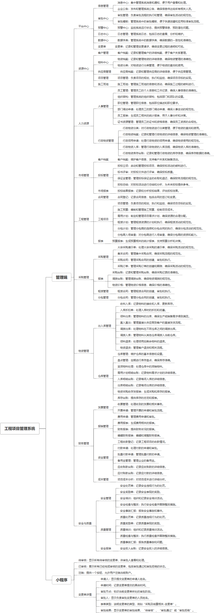

 

    
 

公司拥有上百套具有自主知识产权的软件系统，详情请查看码云首页或公司官网

 
<h1>工程项目管理系统</h1>

<a href="https://www.haishi.net.cn/">公司官网</a> ｜ <a href="https://www.haishi.net.cn/">在线体验</a>

 

## 系统介绍

“工程项目管理系统”是一款专为建筑行业设计的综合性管理软件，旨在提高项目管理效率和透明度。该系统分为管理端和小程序端两部分。管理端提供了全面的功能模块，包括但不限于项目管理、合同管理、施工预算、采购管理、租赁管理、物资管理、财务管理、安全与质量等，能够满足从项目立项到竣工验收整个生命周期的管理需求。而小程序端则侧重于现场人员的便捷操作，如实时查看项目进度、提交物资需求、记录施工现场情况等，确保前线信息与后台数据同步更新，实现高效沟通与协作。通过两端的紧密配合，工程项目管理系统不仅简化了工作流程，还加强了对项目各环节的控制力，为企业带来更高的经济效益和更强的竞争力。
“工程项目管理系统”是一款专为建筑行业设计的综合性管理软件，旨在提高项目管理效率和透明度。该系统分为管理端和小程序端两部分。管理端提供了全面的功能模块，包括但不限于项目管理、合同管理、施工预算、采购管理、租赁管理、物资管理、财务管理、安全与质量等，能够满足从项目立项到竣工验收整个生命周期的管理需求。而小程序端则侧重于现场人员的便捷操作，如实时查看项目进度、提交物资需求、记录施工现场情况等，确保前线信息与后台数据同步更新，实现高效沟通与协作。通过两端的紧密配合，工程项目管理系统不仅简化了工作流程，还加强了对项目各环节的控制力，为企业带来更高的经济效益和更强的竞争力。
本项目名称为工程项目管理系统，是一个面向工程项目全生命周期管理的综合性平台。该系统涵盖了从市场管理、工程管理、采购管理、物资管理、财务管理到安全与质量管理等各个环节，旨在提高工程项目管理效率，降低成本，提升项目质量。系统用户包括公司内部的各个部门和角色，例如项目经理、采购人员、财务人员、安全员、质量员等。
本系统主要功能模块包括：
- 市场管理：客户档案管理、投标管理、投标结果报表等。
- 工程管理：合同登记、工程项目管理、施工预算、需用计划、租赁计划、分包计划、预算报表等。
- 采购管理：大宗采购请示、集采合同、采购合同、采购订单、报表（采购台账、调拨台账、物资价格）、租赁合同、分包合同等。
- 物资管理：出入库管理（收料入库、入库折扣单、领料出库、直入直出、调拨出库、调拨入库、领料退库、物资退货）、仓库管理（仓库管理、盘点管理、呆滞物料处理、需用计划明细台账、入库明细台账、出库明细台账、物资采购收存发报表、库存台账）等。
- 财务管理：发票管理、报销管理、资金管理、项目成本分析等。
- 安全与质量管理：安全管理（安全处罚单、安全奖励单、安全培训、安全检查与整改、安全事故汇报）、质量管理（质量处罚单、质量奖励单、质量培训、质量检查与整改、质量事故汇报）、安全投入台账等。
- 人力资源：人事管理、行政物资管理等。
- 平台中心：信息管理、审批中心、预警中心、日志中心、变更单等。
- 资源中心：客户档案、物料中心、供应商档案、项目管理、施工班组等。
                

## 系统功能介绍

### 系统包含终端说明

管理端（WEB）、用户端（微信小程序）

| 序号 | 模块 | 模块说明 |
| --- | --- | --- |
| 1 | QHY-PMS-GCGL-MANAGE | 管理端 |
| 2 | QHY-PMS-GCGL-SERVER | 服务端 |
| 3 | QHY-PMS-GCGL-MP | 小程序 |

### 系统功能结构

### 系统功能说明

核心功能：
1. 项目管理：涵盖项目从立项到竣工的全过程管理，包括施工预算、需用计划、租赁计划、分包计划等，实现对项目进度、成本、质量的全面控制。
2. 采购管理：支持大宗采购请示、集采合同、采购合同、采购订单等，并提供采购台账、调拨台账、物资价格等报表，方便进行采购跟踪和成本控制。
3. 物资管理：实现物资的出入库管理、仓库管理、盘点管理等，提供多种出入库方式，并生成相关的报表，确保物资的有效管理和利用。
4. 财务管理：包括发票管理、报销管理、资金管理、项目成本分析等，提供全面的财务管理功能，支持工程收款登记、付款申请等，便于进行财务核算和成本控制。
5. 安全与质量管理：提供安全处罚单、安全奖励单、安全培训、安全检查与整改、安全事故汇报等功能，以及质量处罚单、质量奖励单、质量培训、质量检查与整改、质量事故汇报等功能，确保项目的安全和质量。

## 系统主要界面

## 系统技术说明

### 代码模块说明

| 序号 | 目录 | 目录说明 |
| --- | --- | --- |
| 1 | QHY-PMS-GCGL-SERVER/ylja-admin | -- |
| 2 | QHY-PMS-GCGL-SERVER/ylja-business | -- |
| 3 | QHY-PMS-GCGL-SERVER/ylja-security | -- |
| 4 | QHY-PMS-GCGL-SERVER/ylja-bpm | -- |
| 5 | QHY-PMS-GCGL-SERVER/ylja-system | -- |
| 6 | QHY-PMS-GCGL-SERVER/ylja-common | -- |

### 系统技术选型

#### 开发语言/框架

JAVA（JDK1.8）
前端框架：uni-app
前端框架：VUE2
脚手架：RuoYi
框架：SpringBoot2.x
系统结构：单体应用

#### 服务中间件

Nginx
Tomcat

#### 数据库

MySQL（5.7+）

#### 其他说明

无

## 系统演示/商用

请扫码添加客服微信获取演示地址和系统详细资料。

如果您想基于工程项目管理系统进行商业化交付或定制开发服务，我们提供有偿的技术服务支持，合作模式不限，欢迎沟通！

公司官网地址： <a href="https://www.haishi.net.cn/">https://www.haishi.net.cn</a>

联系客服获取专业回答。

## 使用须知

1、 本项目商用必须获得版权所有者的授权。

2、 未经允许本项目代码不允许二次出售。

